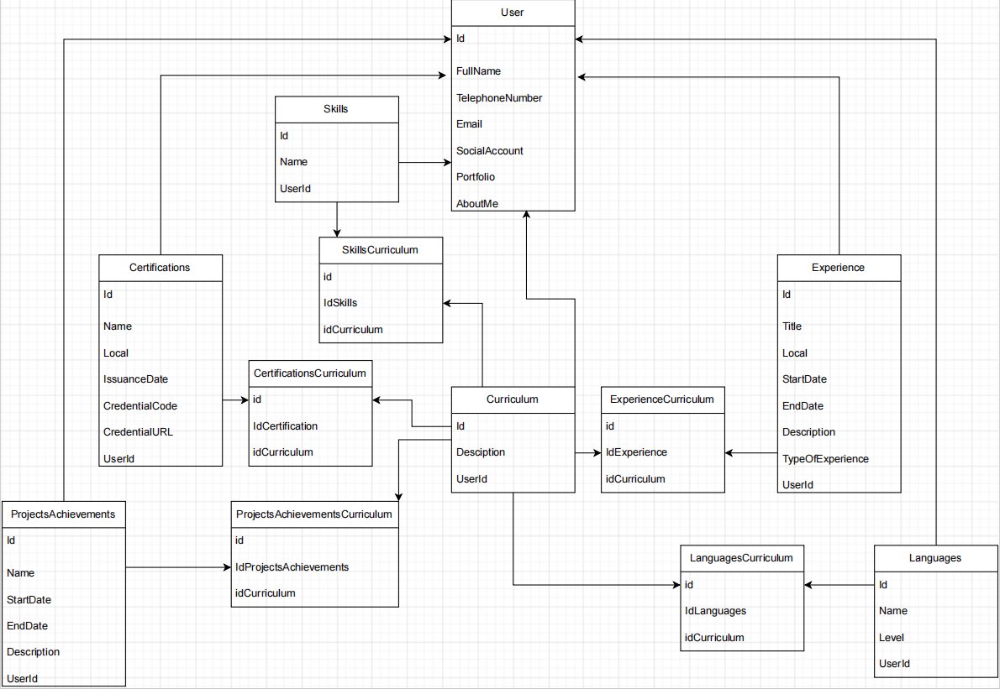

# CV Builder
<h4>Projeto iniciado como parte do processo de aprendizagem visando reforçar conceitos em Java, Spring e Rest API.</h4>

  Durante o desenvolvimento usamos algumas ferramentas de apoio, como:
  * <code class="lang-markdown">Docker</code>
  * <code class="lang-markdown">Trello</code>
  * <code class="lang-markdown">Draw.io</code>

  Para consumo de API e documentação, optou-se por:
  * <code class="lang-markdown">Postman</code>
  * <code class="lang-markdown">Swagger</code>

  Testes unitários no back-end
  * <code class="lang-markdown">JUnit</code>

  <h3>Modelagem de dados</h3>
  
Desenvolvida a partir do site Draw.io: https://app.diagrams.net/ 

    

